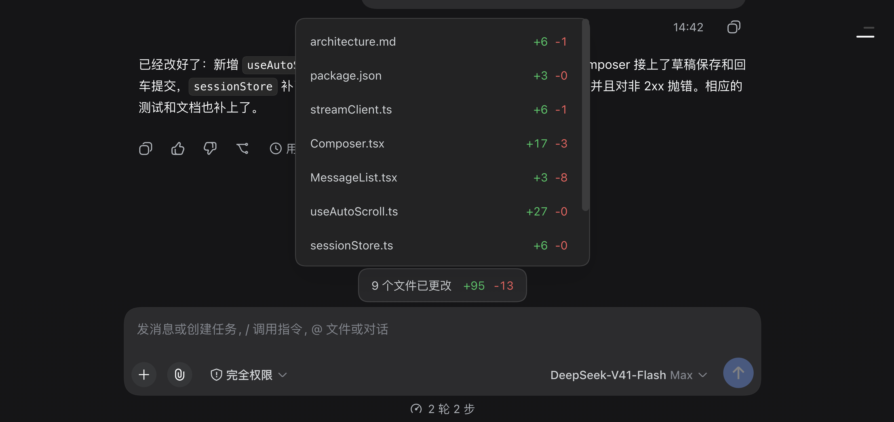
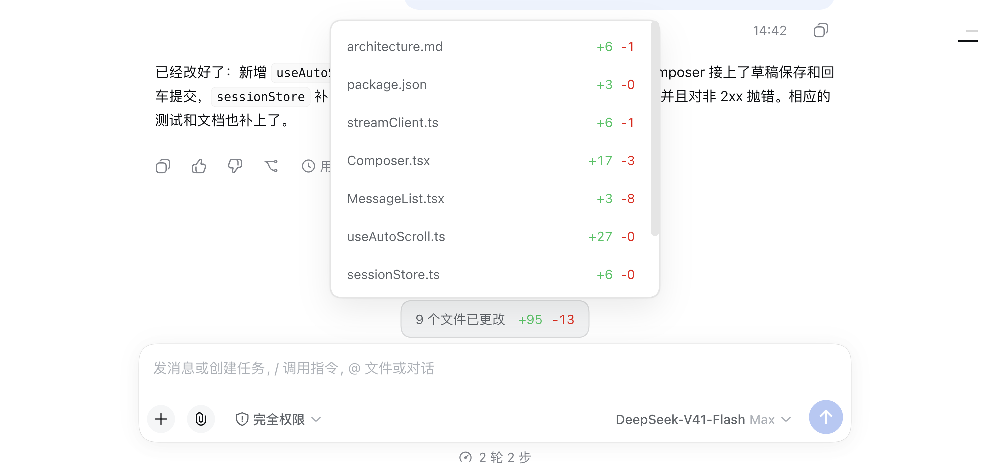

# dsh-chat-diff-summary-legacy

输入框正上方的一条「本轮改动」统计条：这一轮对话动了哪些文件、增删多少行，不用切终端一眼就能看到。

```
                        9 个文件已更改   +95   -13
```


**适用内核：`>=0.1.5-rc.1 <0.1.8`** · 实测 `0.1.5-rc.2`（DSH Desktop 2.0.13）与 `0.1.7-rc.2`（当前桌面版内核）

起点是 **DSH Desktop 2.0.13 / DeepSeek Harness 0.1.5-rc.2** 这条 legacy 线：不使用、也不需要 0.1.6 及之后引入的任何东西，所以 0.1.5 与 0.1.7 两条线共用同一份构建。版本对应关系、自查方法与上界理由见[兼容的 DSH 内核版本](#兼容的-dsh-内核版本)。

---

## 效果

四张图都取自**真实运行**的 DSH Desktop 2.0.13（隔离的 `DSH_HOME`），一轮真实对话里由脚本改动了 9 个文件。不是画出来的示意图。

| 收起 · 深色 | 展开 · 深色 |
|---|---|
|  |  |

| 收起 · 浅色 | 展开 · 浅色 |
|---|---|
|  |  |

展开那两张里能看清最关键的一点：**面板是浮在对话之上的**。它背后压着的正是上一条回复的文字（"已经改好了：新增 `useAutoScroll`…"），面板把它们盖住了，而不是把上面的内容顶开、把输入框上方挤小。

深浅两套配色全部来自宿主自己的主题 token，插件不带任何自己的颜色，所以宿主换肤它跟着换。

## 它统计的是什么

- **`+N` / `-M` 是行数，不是编辑次数。** 改写一行、行数没变，显示的就是 `+1 -1`；删掉一行是 `+0 -1`。新建文件的全部内容算作新增。
- **一轮一测。** 基线在 `turn/start` 时拍下，`turn/end` 时再拍一次，两次工作树快照对比。所以一轮里同一个文件改十次，最终只按净变化算一次。
- **一轮什么都没改，就什么都不显示** —— 不占位、不留空条。
- **范围是整个仓库**：相对仓库根目录统计，路径只显示文件名。
- **预先存在的改动不算。** 你在对话开始前就已经改脏、甚至已经 `git add` 过的东西，在两份快照里都存在，差值为零，不会算到这一轮头上。
- **shell 改动照样算。** 统计读的是磁盘上的工作树，不是工具日志 —— `sed`、脚本、构建产物、Python 一行流，和你手动改文件一视同仁。
- **每个 Session 各算各的**，两个 Session 的数字不会串。

## 一轮运行中就在涨，不等跑完

统计条跟随正在跑的回合，不是等回合结束才出现：

```
t+1…6s   不显示            （还没有改动）
t+7s     1 个文件已更改  +2   （回合仍在运行）
t+14s    2 个文件已更改  +3
t+20s    3 个文件已更改  +6
t+24s    回合结束，数字定格
```

- 每次工具调用落地（`tool/result`）后重新测一次。
- 测量做了合并：同一时刻只有一次测量在跑，同一 Session 两次测量至少间隔 400ms。一串连续的 bash 调用只走一遍树，不会每个调用走一遍。
- 回合结束的那次**永不节流** —— 被间隔挡掉的改动最多是"晚一点显示"，不会丢。
- 浏览器侧在每个持久事件后重读一次，同一时刻只允许一次读取在途；只为客户端渲染的流式分片被刻意排除，否则回复每吐一个字它就要重读一遍。
- 重读如果发现数字没变，快照保持同一个身份 —— 正在跑的回合不会把用户刚展开的文件清单**晃回去**。

## 布局与尺寸

- 统计条**只有自身内容那么宽**（`width: max-content`），是一枚居中的胶囊，不是和输入框等宽的长条。文件名太长会省略号，数字永远完整。
- 文字和数字之间**只隔一个字符**（`gap: 1em`），没有把它们推到两端的弹性占位。
- 展开的清单占输入框宽度的**三分之一**并居中，长文件名有地方可省。
- 清单**一屏 7 行**，高度精确等于 `7 × 38px + 2 × 6px`，所以折行处永远不会出现半截行；其余的靠面板内滚动。
- 滚轮被限制在面板内（`overscroll-behavior: contain`），滚到最后一个文件不会把后面的对话带着滚。
- 窄了就变宽：输入框低于 760px 时清单占 50%，低于 520px 时占满。

在宿主自己的 Chromium 里实测（1000px 宽的对话区）：

```
统计条宽        189px   （= 自身内容：文字 + 1em + 数字 + 内边距）
统计条高         38px
清单宽          330px   （= 对话区 1/3）
清单高          278px   （= 7 × 38 + 2 × 6）
一屏完整行数      7      可滚动：是（本轮 9 个文件）
展开前后条高     38px    顶边不动 —— 什么都没被顶开
面板覆盖         280px   在条上方，盖住对话内容
```

这一轮的 `9 个文件已更改 +95 -13`，与用 `git diff --numstat` 独立算出来的结果逐文件完全一致（`architecture.md +6 -1`、`Composer.tsx +17 -3`、`useAutoScroll.ts +27 -0`……合计 9 个文件 +95 -13）。

## Git 语义：绝不动你的仓库

数字来自**工作树对工作树**的比较，不是 `git diff HEAD`。

所有写入都落在一个 `mkdtemp` 出来的私有临时目录里：

- `GIT_OBJECT_DIRECTORY` 指向临时对象库，新产生的 blob / tree 都写在那儿；仓库自己的对象库通过 `GIT_ALTERNATE_OBJECT_DIRECTORIES` **只读**挂进来。
- 每次快照用自己独立的 `GIT_INDEX_FILE`。
- 私有索引用 `git read-tree HEAD` 初始化。
- 插件从不针对项目索引执行 `git add`，从不 commit，从不碰 HEAD 和 refs，从不 stash / checkout / reset。

`tests/git.spec.ts` 会在一轮"修改、新增、删除、重命名、二进制化"的操作前后，对仓库的 `.git/index`、`HEAD`、`for-each-ref` 输出和 `.git/objects` 下每个文件取哈希，断言四者逐字节不变。临时目录在 Session 销毁和插件销毁时清理。

### 一个值得写下来的真实 bug

私有索引用**复制仓库索引**的方式初始化是不成立的 —— 早期版本就是这么做的。复制来的索引带着仓库的 stat 缓存，而 `git add` 允许信任缓存的 stat：当一次编辑保持文件字节长度不变、而副本自身的 mtime 又晚于该文件时，git 会跳过重新哈希，写出一个装**旧内容**的 tree。

在 macOS + APFS 上实测，40 次等长编辑里有 **2 次**静默产生了过期快照 —— 也就是那一轮改动没被报出来。改用 `git read-tree HEAD`（条目不带 stat 信息，`git add` 必须重新哈希每个路径）后，同一个探针是 **0/40**。这个探针作为回归测试留在 `tests/git.spec.ts` 里。

## 安装

标准 DSH profile bundle：node 半边在 `exports["."]`，浏览器半边在 `exports["./client"]`（通过 `dsh.client` 声明发现），`cordis.patch.yml` 只插入本插件一行，不禁用任何东西。

**link 安装**（profile 跟随工作树，改完 `npm run build` 即可）：

```bash
dsh plugin --profile <profile> add link:/path/to/dsh-chat-diff-summary-legacy
```

**打包安装**（自包含快照，每次改动后重新打包）：

```bash
npm run verify                                  # typecheck + build + 测试
npm pack --pack-destination release             # → release/<name>-<version>.tgz
dsh plugin --profile <profile> add "file:$PWD/release/<name>-<version>.tgz"
```

两种方式都需要 **宿主进程**重新加载才生效，所以装完请重启 DSH Desktop。只重载页面只能带回浏览器半边，node 半边不行。

## 兼容的 DSH 内核版本

| | |
|---|---|
| **声明支持** | `>=0.1.5-rc.1 <0.1.8` —— `package.json` 里的 `dsh.engines.dsh` |
| **实测通过** | `0.1.5-rc.2`（DSH Desktop 2.0.13 搭载的内核）与 `0.1.7-rc.2`（当前桌面版内核） |
| **未实测** | `0.1.5-rc.1`、`0.1.6` 线，以及两条线里的其它补丁版 |
| **不在支持范围** | `0.1.8` 及之后 |

**桌面版号 ≠ 内核版号，别混。** DSH Desktop 走的是 `2.0.x`，DeepSeek Harness 内核走的是 `0.1.x`。本插件实际验证过两个组合：**DSH Desktop 2.0.13 + 内核 0.1.5-rc.2**，以及**当前桌面版 + 内核 0.1.7-rc.2**。

查自己装的是哪个内核版本：

```bash
# @deepseek-ai/dsh-base 的版本就是内核版本
node -p "require(process.env.HOME + '/.dsh/profiles/node_modules/@deepseek-ai/dsh-base/package.json').version"
# → 0.1.5-rc.2
```

**上界为什么是 `0.1.8`**：本插件用到的宿主接口全部是 0.1.5 线就有的 —— `conversation.input.dock` 槽位、`ctx.connection.fetch` 路由注册、`session/event` 与 `tools/pre-execute` 事件。这些接口在 `0.1.7-rc.2` 上逐一核对仍然存在（`ctx.sessions.binding(id)` 返回的仍是 `{ sessionId, session, eventSource, ctx }`），所以上界抬到覆盖当前桌面版内核为止；`0.1.6` 线没有实测过，`0.1.8` 及之后不在声明范围内。

**这个字段是声明，不是闸门。** `dsh.engines.dsh` 和 `@linxin666/*` 等第三方插件用的是同一个字段（都在 `dsh` 对象里，与 `bundle`、`client` 并列）；当前 DSH 的加载路径并不读取它，所以它挡不住加载 —— 它表达的是"作者支持并实测过的范围"，而不是运行时的版本校验。

**为什么叫 legacy**：0.1.6+ / 0.1.7+ 的接口已经存在，本插件刻意只使用 0.1.5-rc.2 就有的那一套，方便仍在 2.0.13 上的用户直接用。node 半边与浏览器半边在运行时都不 import 任何 `@deepseek-ai/*` 包 —— 插件消费的每个宿主服务都在 `src/host.ts` 和 `src/client/contract.ts` 里做了结构化声明，旁边逐条引用了 0.1.5-rc.2 里的调用点。

**刻意没做的**：

- **diff 审阅**。0.1.5-rc.2 没有 `changes-review` 能力，所以点开统计条只是展开/收起一份紧凑的文件清单，文件名是纯文本而不是链接。
- **持久化**。统计活在宿主进程内存里，重启宿主就没了，统计条会诚实地藏起来直到下一轮结束。

**已知边界**：

- 仓库整体统计：Session 的工作目录是仓库子目录时，报出来的路径相对仓库根。
- 两个 Session 同时在同一仓库工作时，各自测量自己的回合边界，但共享同一份工作树 —— 并发改动可能同时出现在两个 Session 的统计里。
- 行数遵循仓库自己的 git 配置，包括 `.gitattributes` 过滤器和 `core.autocrlf`。
- 文件清单最多 200 条；计数保持完整，清单会说明省略了多少条。
- 宿主进程被 `SIGKILL` 时没有任何 disposer 会跑，会在系统临时目录留下 `dsh-chat-diff-legacy-*` 目录。每个这样的目录里都有一份 `.dsh-chat-diff-legacy-scratch.json` 标记（写着所属插件、类型、工作目录）；插件下次启动会清扫**带该标记、且 24 小时内没被写过**的目录，不认标记的一律不动。要手工清也可以，标记文件就是判据。

## 非 Git 工作区

会话的工作目录不在任何仓库里时，插件在**临时目录里自建一个私有仓库**来测量这份目录：`git init` 只发生在 scratch 目录里，工作目录不会被写入 `.git`、索引或对象库（`tests/git.spec.ts` 里有断言）。测量仍然完全交给 git —— `add --all`、`write-tree`、`diff-tree --numstat` —— 插件自己不遍历、不哈希任何文件。

- **一个目录一份工作区，所有 Session 共用**。工作区按 `realpath(cwd)` 归一化后做键（Windows 下大小写不敏感），因此同一目录开多个 Session **只做一次全量第一遍**，第二、第三个 Session 只付一次 stat 扫描的代价；某个 Session 结束时也不会把别人正在用的对象库删掉（引用计数 + 5 分钟空闲窗口，插件卸载时立即回收）。
- **第一遍不再让回合丢数字**。首次遇到该目录时要读一遍被接受的全部文件：实测 1.7 GB / 28k 文件 + 默认忽略集 = **36.7 s**，对象库约 **810 MB**（都在临时目录里）。这一遍现在**排在回合的链上**：`turn/start` 之后的第一个工具调用会等它（宿主门闸等的就是这条链），基线随之建立，**该回合并不会因为预热而报空**——准确优先于不卡顿。等待有上限（`WARMUP_GATE_BUDGET_MS`，默认 120 s）：超过上限的那一轮会在日志里明说"这一轮没有基线、可能什么都不报"，而预热继续在后台跑，下一轮直接受益。此后每轮只是一次 stat 扫描（同一目录实测 **0.13 s**）。
- **第一遍失败会重试，不是永久失效**。失败状态、尝试次数、失败原因都记在共享工作区上；下一轮按指数退避重试（1 s 起，上限 5 分钟），期间不会重复读整个目录。日志里能区分是 `realpath`、`rev-parse`、`git init`、`git config`、`add --all`（首次/增量）、`write-tree`、`diff-tree` 还是超时/中止失败，并带上 session、目录、退出码、git 输出与耗时。
- **默认忽略集**写在私有仓库的 `info/exclude`，目录里已有的 `.gitignore` 照常生效：

  ```text
  .git/  .hg/  .svn/  node_modules/
  dist/  build/  out/  target/  coverage/  __pycache__/  .venv/  venv/
  *.apk  *.zip  *.7z  *.rar  *.exe  *.dll  *.so  *.dylib  *.iso  *.dmg  *.msi
  ```

- **不做行尾转换**：私有仓库里写死 `core.autocrlf=false`、`core.safecrlf=false`，统计的是磁盘上的字节，而不是某个仓库的检出策略。
- **这一模式信任 git 的 stat 缓存**。仓库模式为了保证正确性每轮强制重哈希每个路径（见 `snapshotTree` 的注释），非仓库模式为了成本只重读变过的文件；在时间戳精度很粗的文件系统上（FAT/exFAT、部分网络盘），"改成同样长度、时间戳又恰好相同"的极端情况可能漏报。要强制重读，把目录放进一个仓库里即可（那样走的是仓库模式）。
- **嵌在目录里的 git 仓库**按 git 自己的 embedded repository / gitlink 语义处理：它内部改了什么都**不会**逐文件报出来；只有它自己的提交前进时，统计条列出该目录一行且**不计行数**（`diffSyntheticTrees` 把 gitlink 从 git 报的 `+1 -1` 改写成不可计数，避免编造行数）。要它内部的逐文件统计，把会话 cwd 设到那个仓库里。
- **Windows 的目录联接（junction）会被跟随**，从工作目录走出去的联接内容也会进入快照。默认忽略集覆盖依赖目录与构建产物，但不覆盖任意联接。
- **用户级 `core.excludesFile` 只在 POSIX 上生效**：Windows 下插件交给 git 的环境不含用户 profile 路径，git 读不到 `~/.gitconfig`，所以只有目录内的 `.gitignore` 和上面的默认忽略集在起作用。

## 开发

```bash
npm install
npm run typecheck
npm run build      # lib/index.js（宿主）+ lib/client.js（浏览器）
npm run test       # 198 个测试
npm run verify     # 上面三步依次跑
```

测试 198 个，覆盖：统计路由与文案、真实 git 仓库上的 snapshots / numstat 解析 / 重命名 / 二进制 / 等长编辑回归探针、回合跟踪与节流、共享合成工作区（单次预热 / 并发接入 / 失败重试与退避 / 引用计数与回收）、临时目录清扫的安全判据、跨回合集成、浏览器侧取值与订阅、槽位注册与渲染。

浏览器半边通过 `window.__ModuleLoader__` 加载，因此 `react` 和 `react/jsx-runtime` 必须声明为 external —— `tsdown` 的 `external` 选项和 `peerDependencies` 两处都要写，因为 tsdown 0.15 没有 `deps.neverBundle` 这个键，而无法识别的选项是**静默失效**的，会打进第二份 React（`tests/bundle.spec.ts` 断言产物里只有两个 `require`）。

> `lib/` 是构建产物，随仓库一起提交，这样 clone 下来即可被 `dsh plugin add link:` 加载；改动源码后请重新 `npm run build`。

更完整的英文说明（含逐项验证记录）见 [README.en.md](README.en.md)。

## License

[MIT](LICENSE)
